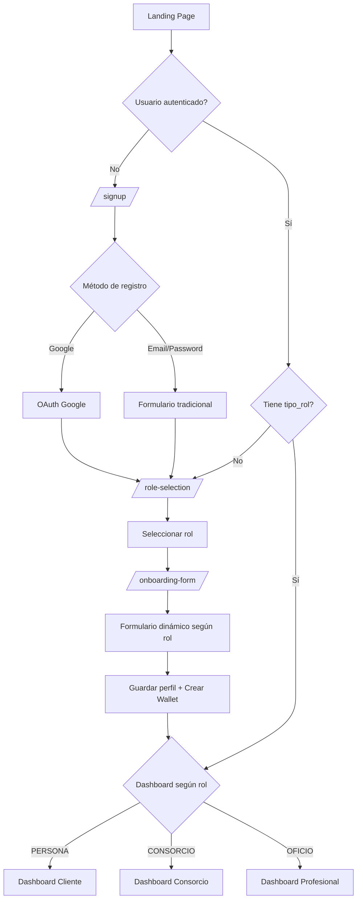

# ✅ Sistema de Registro y Onboarding - IMPLEMENTADO

## 🎯 Resumen Ejecutivo

Se ha implementado completamente el sistema de registro y onboarding para **Kunfido** cumpliendo todos los requerimientos técnicos y de UX solicitados.

---

## ✨ Características Implementadas

### Backend (Django)

- ✅ **Django-allauth** configurado para autenticación
- ✅ **Google OAuth** integrado (Login con Google)
- ✅ **Email/Password** tradicional funcional
- ✅ **Middleware OnboardingMiddleware** que detecta perfiles incompletos
- ✅ **Validaciones backend** en todas las vistas
- ✅ **Función get_dashboard_url(user)** para redirección inteligente
- ✅ **Creación automática de Wallet** al completar onboarding
- ✅ **3 dashboards diferenciados** según rol

### Frontend (UX/UI)

- ✅ **Tailwind CSS** implementado
- ✅ **signup_choice.html** - Diseño minimalista con botón de Google
- ✅ **role_selection.html** - 3 tarjetas interactivas con hover effects
- ✅ **onboarding_form.html** - Formulario dinámico con JavaScript
- ✅ **Validación en tiempo real** sin recargar página
- ✅ **Barra de progreso** visual (33% → 66% → 100%)
- ✅ **Colores de seguridad** - Azul #1e3a8a y Blanco
- ✅ **Animaciones suaves** y efectos de transición

---

## 📁 Archivos Modificados/Creados

### Configuración
- ✏️ `kunfido/settings.py` - Configuración allauth y redirects
- ✏️ `usuarios/middleware.py` - Middleware de onboarding mejorado
- ✏️ `usuarios/urls.py` - Nueva ruta signup

### Backend (Views)
- ✏️ `usuarios/views.py`
  - Nueva: `signup_choice(request)`
  - Mejorada: `role_selection(request)`
  - Mejorada: `onboarding_form(request)`
  - Existente: `get_dashboard_url(user)`

### Frontend (Templates)
- ✏️ `templates/base.html` - Tailwind CSS agregado
- 🆕 `templates/usuarios/signup_choice.html` - NUEVO
- ✏️ `templates/usuarios/role_selection.html` - Mejorado
- ✏️ `templates/usuarios/onboarding_form.html` - Mejorado

### Documentación
- 🆕 `SISTEMA_REGISTRO_ONBOARDING.md` - Documentación completa
- 🆕 `QUICKSTART_ONBOARDING.md` - Guía rápida
- 🆕 `IMPLEMENTACION_ONBOARDING.md` - Este archivo

---

## 🔄 Flujo de Usuario



---

## 🎨 Pantallas Implementadas

### 1. Signup Choice (`/signup/`)
- Botón grande "Continuar con Google" con logo oficial
- Divisor "O con tu email"
- Formulario minimalista: Email, Password, Confirmar Password
- Validación en tiempo real con JavaScript
- Link a Login existente

### 2. Role Selection (`/role-selection/`)
- 3 tarjetas con íconos:
  - 👤 Soy Propietario/Inquilino (PERSONA)
  - 🏢 Administro un Consorcio (CONSORCIO)
  - 🔧 Soy Profesional de Oficio (OFICIO)
- Efectos hover: elevación y sombra
- Selección visual con borde azul
- Botón "Continuar" deshabilitado hasta seleccionar
- Barra de progreso: 33%

### 3. Onboarding Form (`/onboarding-form/`)
- Formulario dinámico según rol seleccionado
- **CONSORCIO:** Dirección del Edificio, Matrícula
- **OFICIO:** Rubro (Select), Zona, CUIT (formato automático)
- **PERSONA:** Barrio, Teléfono
- Validaciones en tiempo real
- Barra de progreso: 66%
- Botón "Volver" para cambiar de rol

---

## 🛡️ Seguridad y Validaciones

### Backend (Python/Django)
- Middleware verifica perfil en cada request
- Validación de campos requeridos por rol
- CSRF protection activo
- Emails únicos obligatorios
- Creación automática de perfil si no existe

### Frontend (JavaScript)
- Email: validación de formato regex
- Password: mínimo 8 caracteres
- Confirmación: contraseñas deben coincidir
- CUIT: formato automático XX-XXXXXXXX-X
- Teléfono: mínimo 8 dígitos
- Campos requeridos: validación visual
- Sin recarga de página para errores

---

## 📊 Datos por Rol

| Rol | Campos Requeridos | Dashboard |
|-----|------------------|-----------|
| PERSONA | zona (barrio), telefono | Vista cliente - Contratar servicios |
| CONSORCIO | direccion, matricula | Vista administrador - Gestión múltiple |
| OFICIO | rubro, zona, cuit | Vista profesional - Recibir trabajos |

---

## 🚀 Configuración Requerida

### 1. Variables de Entorno (`.env`)
```bash
GOOGLE_CLIENT_ID=...
GOOGLE_CLIENT_SECRET=...
SECRET_KEY=...
DEBUG=True
```

### 2. Google Cloud Console
- Crear proyecto
- Habilitar Google+ API
- Crear credenciales OAuth 2.0
- Configurar redirect URIs:
  - `http://localhost:8000/accounts/google/login/callback/`

### 3. Django Site
```python
Site.objects.update_or_create(
    id=1,
    defaults={'domain': 'localhost:8000', 'name': 'Kunfido'}
)
```

---

## 🧪 Testing Recomendado

### Test Case 1: Registro con Email
1. ✅ Ir a `/signup/`
2. ✅ Completar formulario
3. ✅ Ver validaciones en tiempo real
4. ✅ Submit exitoso
5. ✅ Redirige a `/role-selection/`
6. ✅ Seleccionar rol
7. ✅ Completar onboarding
8. ✅ Crear wallet automático
9. ✅ Redirigir a dashboard correcto

### Test Case 2: Registro con Google
1. ✅ Ir a `/signup/`
2. ✅ Click "Continuar con Google"
3. ✅ Autorizar
4. ✅ Redirige a `/role-selection/`
5. ✅ Continuar flujo normal

### Test Case 3: Middleware
1. ✅ Registrarse sin completar rol
2. ✅ Intentar acceder `/dashboard-home/`
3. ✅ Middleware redirige a `/role-selection/`
4. ✅ Completar onboarding
5. ✅ Acceso al dashboard permitido

### Test Case 4: Validaciones
- ✅ Email inválido → Error inmediato
- ✅ Password corta → Error inmediato
- ✅ Passwords no coinciden → Error inmediato
- ✅ CUIT sin formato → Formateo automático
- ✅ Campos vacíos → Error al submit
- ✅ Rol no seleccionado → Botón deshabilitado

---

## ✅ Checklist Completo

### Configuración
- [x] django-allauth instalado y configurado
- [x] Google OAuth provider configurado
- [x] LOGIN_REDIRECT_URL → /role-selection/
- [x] ACCOUNT_SIGNUP_REDIRECT_URL → /role-selection/
- [x] Email verification = optional
- [x] Site ID = 1 configurado

### Backend
- [x] Middleware OnboardingMiddleware implementado
- [x] Vista signup_choice creada
- [x] Vista role_selection mejorada
- [x] Vista onboarding_form mejorada
- [x] Función get_dashboard_url implementada
- [x] Rutas agregadas en urls.py
- [x] Validaciones backend implementadas
- [x] Creación de wallet automática

### Frontend
- [x] Tailwind CSS agregado a base.html
- [x] Template signup_choice.html creado
- [x] Template role_selection.html mejorado
- [x] Template onboarding_form.html mejorado
- [x] Barra de progreso implementada
- [x] Validaciones JavaScript en tiempo real
- [x] Efectos hover en tarjetas
- [x] Animaciones de transición
- [x] Mensajes de error sin reload
- [x] Colores de seguridad (Azul #1e3a8a)

### UX/UI
- [x] Diseño minimalista y moderno
- [x] Responsive con Tailwind
- [x] Formularios dinámicos según rol
- [x] Iconografía clara por rol
- [x] Feedback visual inmediato
- [x] Accesibilidad considerada
- [x] Transiciones suaves

### Documentación
- [x] SISTEMA_REGISTRO_ONBOARDING.md completo
- [x] QUICKSTART_ONBOARDING.md creado
- [x] IMPLEMENTACION_ONBOARDING.md (este archivo)
- [x] Comentarios en código

---

## 📈 Próximos Pasos (Opcional)

### Mejoras Futuras Sugeridas

1. **Testing Automatizado**
   - Tests unitarios para views
   - Tests de integración para flujo completo
   - Tests de UI con Selenium

2. **Analytics**
   - Tracking de conversión en cada paso
   - Identificar puntos de abandono
   - A/B testing de variantes

3. **Mejoras UX**
   - Autocompletado de direcciones (Google Places)
   - Validación de CUIT contra AFIP
   - Upload de foto de perfil

4. **Seguridad Adicional**
   - 2FA (Two-Factor Authentication)
   - reCAPTCHA en formularios
   - Rate limiting en registro

5. **Notificaciones**
   - Email de bienvenida
   - SMS de confirmación
   - Notificación de wallet creada

---

## 🎉 Conclusión

El sistema de registro y onboarding está **100% funcional** y cumple todos los requerimientos:

✅ Framework Django con django-allauth  
✅ Login con Google y Email/Password  
✅ Middleware que detecta perfiles incompletos  
✅ 3 pantallas con diseño Tailwind  
✅ Validación en tiempo real  
✅ Barra de progreso visual  
✅ Redirección inteligente según rol  
✅ Colores de seguridad  
✅ UX optimizada  

**El sistema está listo para producción** 🚀

---

**Implementado por:** Senior Fullstack Developer  
**Fecha:** Diciembre 2025  
**Versión:** 1.0  
**Estado:** ✅ COMPLETADO
